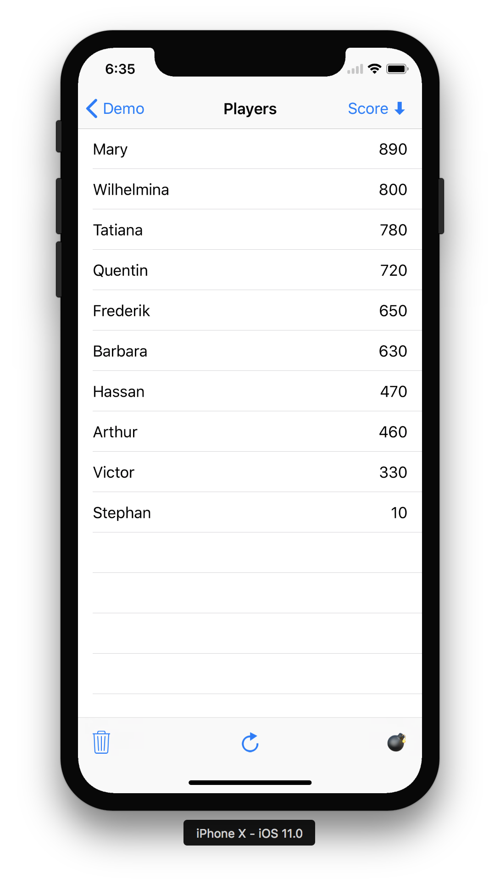
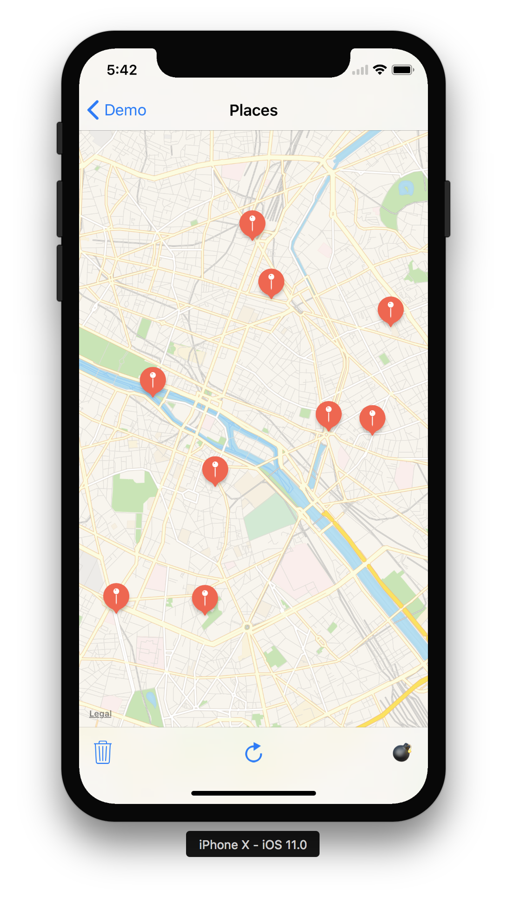

RxGRDBDemo
==========

This demo application uses [RxSwift], [RxGRDB], and [Differ](https://github.com/tonyarnold/Differ) to synchronize its view with the content of the database.

To play with it, download the RxGRDB repository and all its submodules, open `RxGRDB.xcworkspace` at the root of the repository, and run the RxGRDBDemo application.

The rows of the players table view animate as you change the players ordering, delete all players, or refresh them (refreshing applies random transformations to the database)

The annotations of the map view move, appear, and disappear as you refresh the map view content.

In both screens, the bomb icon spawns 50 dispatch items that concurrently perform random database transformations.

Relevant view controllers:

- [PlayersViewController](RxGRDBDemo/PlayersViewController.swift)
- [PlacesViewController](RxGRDBDemo/PlacesViewController.swift)

|         |         |
| :-----: | :-----: |
|  |  |

[Differ]: https://github.com/tonyarnold/Differ
[RxGRDB]: http://github.com/RxSwiftCommunity/RxGRDB
[RxSwift]: https://github.com/ReactiveX/RxSwift
